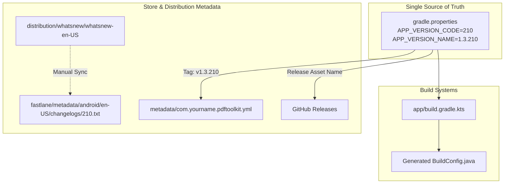

# Distribution Metadata & Release Ecosystem Audit

**Document Path:** `docs/reports/distribution-metadata-audit.md`  
**Date:** 2026-08-08  
**Author:** Antigravity AI Agent  
**Scope:** Repository-wide audit of Fastlane metadata, F-Droid metadata, store listings, GitHub releases, release notes, and documentation metadata.  
**Mode:** Audit and Report Only (No code or metadata modifications).  

---

## Executive Summary

Following the versioning architecture migration (where `gradle.properties` was established as the sole source of truth for version codes and version names), an audit of all distribution metadata was conducted.

### Key Audit Findings
1. **Fastlane Changelog Missing for Current Version:** Fastlane metadata contains `changelogs/1.txt` and `changelogs/175.txt`, but **lacks `changelogs/210.txt`**. Fastlane supply uploads `changelogs/<versionCode>.txt` during Play Store deployments.
2. **Missing F-Droid Top-Level Version Metadata:** `metadata/com.yourname.pdftoolkit.yml` lacks top-level `CurrentVersion: 1.3.210` and `CurrentVersionCode: 210` declarations.
3. **Fragmented Store Release Notes:** Release notes are duplicated between `distribution/whatsnew/whatsnew-en-US` and `fastlane/metadata/android/en-US/changelogs/`, with no root `CHANGELOG.md` file tracking release history.
4. **Boilerplate Package Domain:** The application package name `com.yourname.pdftoolkit` uses the boilerplate `com.yourname` prefix across F-Droid metadata, Gradle configurations, and Android manifests. While consistent, it should be noted if domain re-branding is ever planned.

---

## Phase 1 — Fastlane Audit

Location: `fastlane/metadata/android/en-US/`

| File / Artifact | Version Reference | Status | Action Needed |
|---|---|---|---|
| `full_description.txt` | General Feature Description | ✅ **Valid** | None |
| `short_description.txt` | Store Tagline | ✅ **Valid** | None |
| `title.txt` | App Title ("PDF Toolkit") | ✅ **Valid** | None |
| `changelogs/1.txt` | `versionCode 1` | ℹ️ Historical | Keep for historical reference |
| `changelogs/175.txt` | `versionCode 175` | ℹ️ Historical | Keep for historical reference |
| `changelogs/210.txt` | `versionCode 210` | ⚠️ **MISSING** | **Create `changelogs/210.txt`** matching version code 210 |
| `images/phoneScreenshots/` | Play Store Mobile Screenshots | ✅ **Valid** | None |

---

## Phase 2 — F-Droid Metadata Audit

Location: `metadata/com.yourname.pdftoolkit.yml`

| Metadata Field | Current Value | Expected Value (`gradle.properties`) | Status | Action Needed |
|---|---|---|---|---|
| `CurrentVersion` | *Field Missing* | `1.3.210` | ⚠️ **MISSING** | Add top-level `CurrentVersion: 1.3.210` |
| `CurrentVersionCode` | *Field Missing* | `210` | ⚠️ **MISSING** | Add top-level `CurrentVersionCode: 210` |
| `Builds[0]` | `versionName: 1.3.175` / `175` | `1.3.175` / `175` | ℹ️ Historical | Retain as historical build recipe |
| `Builds[1]` | `versionName: 1.3.210` / `210` | `1.3.210` / `210` | ✅ **Valid** | Active build recipe for `8c479bf475` |
| `AutoUpdateMode` | `Version` | `Version` | ✅ **Valid** | None |
| `UpdateCheckMode` | `Tags` | `Tags` | ✅ **Valid** | None |
| `UpdateCheckData` | `gradle.properties\|APP_VERSION_CODE...` | Matches regex | ✅ **Valid** | None |
| `Repo` | `https://github.com/Karna14314/Pdf_Tools` | Correct repository | ✅ **Valid** | None |

---

## Phase 3 — Release Notes & Changelog Audit

| Asset | Current Location | State | Gaps Identified |
|---|---|---|---|
| **Play Store Release Notes** | `distribution/whatsnew/whatsnew-en-US` | Updated (15 Languages update) | Duplicated manually in deploy workflow |
| **Fastlane Store Changelog** | `fastlane/metadata/android/en-US/changelogs/` | Stale (Max 175) | Missing `210.txt` |
| **Central Changelog** | Repository Root | ❌ Missing | No `CHANGELOG.md` exists in repository |
| **GitHub Release Notes** | Auto-generated in `deploy.yml` | Derived from git commit log | Works dynamically from latest git commit |

---

## Phase 4 — GitHub Release Audit

Inspected `.github/workflows/deploy.yml` post-migration:

| Release Attribute | Source of Truth | Verification Status |
|---|---|---|
| **Release Tag** | Derived from `gradle.properties` (`v${APP_VERSION_NAME}`) | ✅ **PASSED** |
| **Release Title** | `Version ${APP_VERSION_NAME}` | ✅ **PASSED** |
| **Release Description** | Generated `release_description.txt` + commit message | ✅ **PASSED** |
| **Asset Naming (AAB)** | `pdftoolkit-aab-v${APP_VERSION_NAME}.aab` | ✅ **PASSED** |
| **Asset Naming (APKs)** | `pdftoolkit-${flavor}-v${APP_VERSION_NAME}.apk` | ✅ **PASSED** |

---

## Phase 5 — Store Listing Audit

Inspected `fastlane/metadata/android/en-US/`:
- **Title:** `PDF Toolkit` (Clean, concise).
- **Short Description:** `All-in-one PDF and image toolkit for Android` (39 chars, within 80-char Play Store limit).
- **Full Description:** Describes 15 core features including PDF merge, split, compress, convert, OCR, watermarking, password protection, and digital signatures. Accurately distinguishes Play Store (ML Kit) and F-Droid (Tesseract OCR) capabilities.

---

## Phase 6 — Repository Metadata Audit

| File | Content Checked | Status | Action Needed |
|---|---|---|---|
| `README.md` | Download links, badges, flavor table | ⚠️ Minor Stale | Table lists F-Droid status as `F-Droid (pending)`. Update once published. |
| `AGENTS.md` | F-Droid versioning rules & instructions | ✅ **Valid** | Matches single source of truth guidelines. |
| `docs/audits/` | Hardening & versioning audit reports | ✅ **Valid** | Complete historical record preserved. |
| `docs/reports/` | Pipeline & build verification reports | ✅ **Valid** | Complete post-migration verification. |

---

## Phase 7 — Release Ecosystem Map



### Version Sources
- **Canonical SOT:** `gradle.properties` (`APP_VERSION_CODE=210`, `APP_VERSION_NAME=1.3.210`).
- **Consumptive Sites:** `app/build.gradle.kts` -> `BuildConfig.java`.

### Metadata Sources
- **Play Store Metadata:** `fastlane/metadata/android/en-US/` & `distribution/whatsnew/whatsnew-en-US`.
- **F-Droid Metadata:** `metadata/com.yourname.pdftoolkit.yml`.
- **GitHub Release Metadata:** `.github/workflows/deploy.yml` (`release_description.txt`).

### Duplication Risks
- **Changelog Fragmentation:** Release notes are manually copied between `distribution/whatsnew/whatsnew-en-US` and Fastlane `changelogs/`.
- **F-Droid Build Recipe:** Each new version requires appending a `Builds` block entry in `metadata/com.yourname.pdftoolkit.yml` or relying on `AutoUpdateMode: Version`.

### Release Risks
1. **Missing Fastlane Changelog (Medium Risk):** Fastlane uploads fail or fall back to old changelogs if `fastlane/metadata/android/en-US/changelogs/<versionCode>.txt` is missing during a Fastlane deployment run.
2. **Missing Top-Level F-Droid Version (High Risk):** Without `CurrentVersion` and `CurrentVersionCode` declared at the top level of `metadata/com.yourname.pdftoolkit.yml`, F-Droid index generators may display outdated version information in the F-Droid client app UI.

---

## Recommended Cleanup (Prioritized)

### Critical Priority (Immediate Action Required Before Store Release)
1. **Create Fastlane Changelog `210.txt`:** Create `fastlane/metadata/android/en-US/changelogs/210.txt` with release notes matching version code 210.

### High Priority (Recommended Before Next Git Push)
2. **Add Top-Level F-Droid Version Fields:** Update `metadata/com.yourname.pdftoolkit.yml` to include:
   ```yaml
   CurrentVersion: 1.3.210
   CurrentVersionCode: 210
   ```

### Medium Priority (Documentation & Maintenance)
3. **Consolidate Whatsnew and Fastlane Changelogs:** Symlink or automate copy of `distribution/whatsnew/whatsnew-en-US` to `fastlane/metadata/android/en-US/changelogs/${VERSION_CODE}.txt` during release builds.
4. **Create Root `CHANGELOG.md`:** Add a central `CHANGELOG.md` in the repository root documenting version history across all releases.

### Low Priority (Future Cleanups)
5. **Update README.md F-Droid Badge:** Update F-Droid status badge in `README.md` once F-Droid inclusion build completes.
